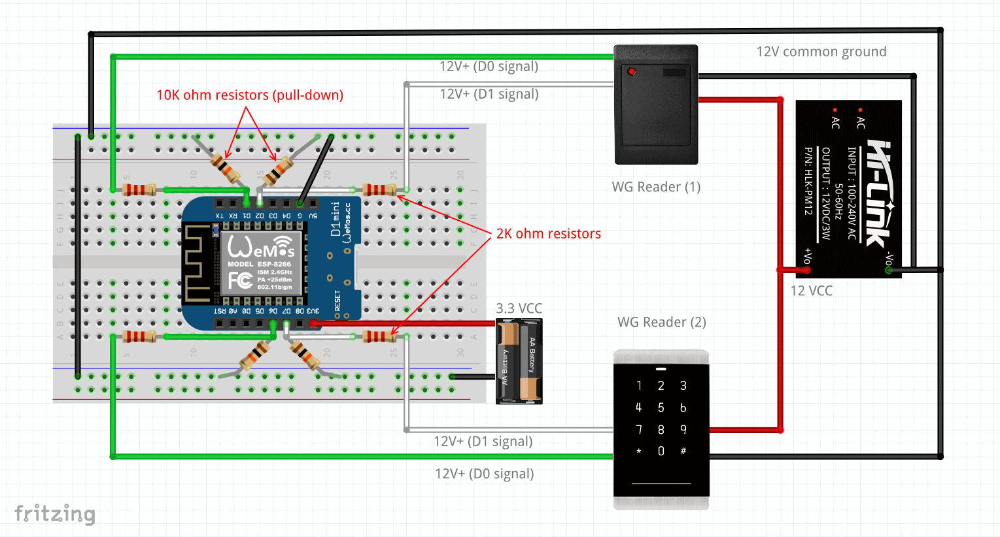

# arduino-wiegand-multi-reader

A multi-reader library for Wiegand Access Devices, for Arduino _and_ ESP8266/ESP32.

Supports protocols for 4 bit, 8 bit, 24 bit, 26 bit, 32 bit and 34 bit Wiegand.

Based on [`monkeyboard/Wiegand-Protocol-Library-for-Arduino`](https://github.com/monkeyboard/Wiegand-Protocol-Library-for-Arduino).


# Usage

This example is for ESP8266 boards.

If you're using a newer ESP32 board make sure you replace `ICACHE_RAM_ATTR` below with `IRAM_ATTR`.

```cpp

#include "WiegandMultiReader.h"

// Define Reader 1 (Card reader)
WIEGAND cardReader();
int cardPinD0 = 5; // D1 (GPIO5) GREEN "D0"
int cardPinD1 = 4; // D2 (GPIO4) WHITE "D1"
void ICACHE_RAM_ATTR cardReadD0() {
  cardReader.ReadD0();
}
void ICACHE_RAM_ATTR cardReadD1() {
  cardReader.ReadD1();
}

// Define Reader 2 (Keypad)
WIEGAND keypadReader();
int keypadPinD0 = 12; // D6 (GPIO12) GREEN "D0"
int keypadPinD1 = 13; // D7 (GPIO13) WHITE "D1"
void ICACHE_RAM_ATTR keypadReadD0() {
  keypadReader.ReadD0();
}
void ICACHE_RAM_ATTR keypadReadD1() {
  keypadReader.ReadD1();
}

void setup() {
  Serial.begin(115200);
  Serial.println();

  Serial.println("Starting Wiegand Card Reader..");
  pinMode(cardPinD0, INPUT);
  pinMode(cardPinD1, INPUT);
  attachInterrupt(digitalPinToInterrupt(cardPinD0), cardReadD0, FALLING);
  attachInterrupt(digitalPinToInterrupt(cardPinD1), cardReadD1, FALLING);

  Serial.println("Starting Wiegand Keypad..");
  pinMode(keypadPinD0, INPUT);
  pinMode(keypadPinD1, INPUT);
  attachInterrupt(digitalPinToInterrupt(keypadPinD0), keypadReadD0, FALLING);
  attachInterrupt(digitalPinToInterrupt(keypadPinD1), keypadReadD1, FALLING);
  
  Serial.println("Ready for input..");
}

void loop() {
  if(cardReader.available())
  {
    Serial.print("cardReader WG HEX = ");
    Serial.print(cardReader.getCode(),HEX);
    Serial.print(", DECIMAL = ");
    Serial.print(cardReader.getCode());
    Serial.print(", Type W");
    Serial.println(cardReader.getWiegandType());    
  }
  if(keypadReader.available())
  {
    Serial.print("keypadReader WG HEX = ");
    Serial.print(keypadReader.getCode(),HEX);
    Serial.print(", DECIMAL = ");
    Serial.print(keypadReader.getCode());
    Serial.print(", Type W");
    Serial.println(keypadReader.getWiegandType());    
  }
}

```

# Schematic



Given that most Wiegand devices are 12V rated (to support longer wires due to voltage drop), we need to make sure that we work around the signal voltage differences by using a 10K Ohm resistor pulling excess voltage to ground.

This way the microcontroller will only receive minimal amperage using the voltage that its running at.


# Licensing / Credits

_This library is free software; you can redistribute it and/or modify it under the terms of the GNU Lesser General Public License as published by the Free Software Foundation; either version 2.1 of the License, or (at your option) any later version._

_This library is distributed in the hope that it will be useful, but WITHOUT ANY WARRANTY; without even the implied warranty of MERCHANTABILITY or FITNESS FOR A PARTICULAR PURPOSE. See the GNU Lesser General Public License for more details._
